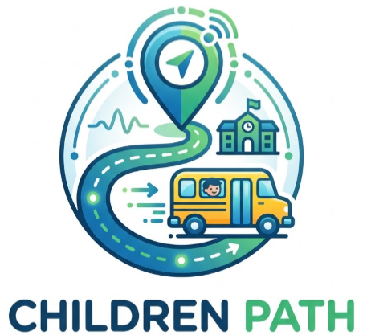
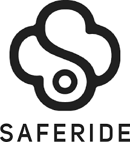
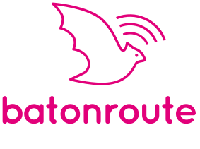

# **Chapter II: Requirements Elicitation & Analysis**

## **2.1. Competidores**

El ecosistema del transporte escolar en Perú se encuentra en un punto crítico, donde el alto nivel de informalidad y la congestión vehicular chocan con la creciente necesidad de seguridad y transparencia por parte de las familias. Si bien existen soluciones de rastreo genéricas o plataformas institucionales costosas, el usuario local (tanto el conductor independiente como el padre de familia) se enfrenta a herramientas que no están adaptadas a su realidad: aplicaciones que distraen al volante, sistemas inaccesibles económicamente o métodos manuales obsoletos. En este escenario, Children Path no solo compite en funcionalidad, sino que busca resolver las brechas de automatización, seguridad vial y accesibilidad que los servicios actuales han dejado desatendidas.

A continuación, se describen los tres competidores más relevantes:

- **SafeRide:**
Es una plataforma con presencia en el mercado local enfocada en conectar a los padres con los servicios de transporte escolar. Destaca por ofrecer rastreo GPS y notificaciones básicas. Su enfoque está dirigido a modernizar rutas independientes, pero todavía depende de ciertas interacciones manuales por parte del conductor, lo que no soluciona por completo el problema de las distracciones al volante en medio del tráfico urbano.

- **BatOnRoute:**
De alcance internacional y con presencia en Hispanoamérica, es una solución de software B2B muy robusta dirigida a colegios privados y grandes flotas. Ofrece un control exhaustivo mediante paneles administrativos complejos y lectura de códigos QR o tarjetas RFID para los estudiantes. Se posiciona como una herramienta institucional poderosa, pero su alto costo y complejidad la hacen inaccesible para el conductor independiente o la pequeña empresa de transporte que busca digitalizarse rápidamente.

- **Life360:**
Aunque no es una aplicación exclusiva de transporte escolar, es líder mundial en el rastreo y seguridad familiar. Su alta adopción permite a los padres saber la ubicación de sus hijos y recibir alertas de llegada a lugares frecuentes (como el colegio o la casa). Su ventaja reside en su precisión y facilidad de uso; sin embargo, carece de funcionalidades vitales para el sector, como la gestión de listas de pasajeros, el reporte de inasistencias o un panel para que el conductor optimice su ruta diaria.

### **2.1.1. Análisis competitivo**

<table border="2" cellspacing="0" cellpadding="5">
  <tr>
    <th colspan="7">Competitive Analysis Landscape</th>
  </tr>
  <tr>
    <td colspan="2" rowspan="1">¿Por qué llevar a cabo este análisis?</td>
    <td colspan="5">Identificar características, funciones y estrategias similares y diferentes entre nuestro producto y 3 competidores clave.</td>
  </tr>
  <tr>
    <td colspan="3"></td>
    <td style="text-align: center;">
      Childre Path 
      
    </td>
    <td style="text-align: center;">
      SafeRide 
      
    </td>
    <td style="text-align: center;">
      BatOnRoute 
      
    </td>
    <td style="text-align: center;">
      Life360 
      
    </td>
  </tr>
  <tr>
    <td rowspan="2">Perfil</td>
    <td colspan="2">Overview</td>
    <td>Plataforma SaaS de rastreo escolar automatizado y sin distracciones.</td>
    <td>App local para seguimiento de rutas escolares y conexión con padres.</td>
    <td>Software B2B institucional para la gestión integral de flotas escolares.</td>
    <td>App global enfocada en la ubicación y seguridad de la familia.</td>
  </tr>
  <tr>
    <td colspan="2">Ventaja competitiva ¿Qué valor ofrece a los clientes?</td>
    <td>Alertas por proximidad automatizadas y UX para cero distracciones al conducir.</td>
    <td>Enfoque en el mercado local y servicio directo para apoderados.</td>
    <td>Gestión administrativa avanzada, reportes y control por RFID/QR.</td>
    <td>Alta fiabilidad de ubicación, detección de choques y uso multipropósito.</td>
  </tr>
  <tr>
    <td rowspan="2">Perfil de Marketing</td>
    <td colspan="2">Mercado objetivo</td>
    <td>Conductores independientes, pequeñas flotas y padres en Lima Metropolitana.</td>
    <td>Padres de familia y transportistas en zonas urbanas de Perú.</td>
    <td>Colegios privados de nivel socioeconómico alto y empresas de flotas.</td>
    <td>Familias en general que buscan monitorear a sus miembros diariamente.</td>
  </tr>
  <tr>
    <td colspan="2">Estrategias de marketing</td>
    <td>Alianzas con APAFAs y crecimiento impulsado por el "boca a boca" de conductores.</td>
    <td>Marketing en redes sociales y asociaciones locales.</td>
    <td>Ventas B2B directas institucionales y presencia corporativa.</td>
    <td>Modelo viral freemium y programas de referidos digitales.</td>
  </tr>
  <tr>
    <td rowspan="3">Perfil de Producto</td>
    <td colspan="2">Productos & Servicios</td>
    <td>SaaS Web (Administración) y App Móvil (Modo conductor optimizado y notificaciones para padres).</td>
    <td>App Móvil para conductores y padres, con rastreo en tiempo real.</td>
    <td>Dashboard Web avanzado, App Conductor, App Padres e integración de hardware.</td>
    <td>App Móvil (iOS/Android) de localización y reportes de conducción.</td>
  </tr>
  <tr>
    <td colspan="2">Precios & Costos</td>
    <td>Modelo Freemium SaaS (Suscripción mensual accesible para conductores/flotas).</td>
    <td>Suscripción por ruta o pago mensual por cantidad de alumnos.</td>
    <td>Licencias anuales de alto ticket por colegio o volumen de flota.</td>
    <td>Freemium (Planes premium mensuales/anuales para seguridad extra).</td>
  </tr>
  <tr>
    <td colspan="2">Canales de distribución (Web y/o Móvil)</td>
    <td>Plataforma Web y App Móvil.</td>
    <td>Principalmente Móvil (iOS/Android).</td>
    <td>Web y Móvil.</td>
    <td>Principalmente Móvil (iOS/Android).</td>
  </tr>
  <tr>
    <td rowspan="5">Análisis SWOT</td>
  </tr>
  <tr>
    <td colspan="2">Fortalezas</td>
    <td>IDiseño enfocado en la seguridad del conductor y formalización del sector informal.</td>
    <td>Conocimiento del mercado local y facilidad de conexión directa.</td>
    <td>Robustez del software y confianza por parte de instituciones formales.</td>
    <td>Infraestructura técnica impecable y adopción masiva por los usuarios.</td>
  </tr>
  <tr>
    <td colspan="2">Debilidades</td>
    <td>Marca nueva enfrentándose a la resistencia tecnológica de conductores mayores.</td>
    <td>Requiere cierta interacción manual que puede distraer al conductor.</td>
    <td>Precio prohibitivo e implementación compleja para el mercado independiente.</td>
    <td>Carece de gestión de rutas, control de alumnos y notificaciones escolares.</td>
  </tr>
  <tr>
    <td colspan="2">Oportunidades</td>
    <td>Alta demanda de seguridad (78% de padres preocupados en Lima) y sector con poca adopción digital.</td>
    <td>Expansión hacia otras ciudades principales de Perú.</td>
    <td>Mayor digitalización de colegios privados y regulaciones de transporte.</td>
    <td>Integrar funcionalidades específicas para instituciones educativas.</td>
  </tr>
  <tr>
    <td colspan="2">Amenazas</td>
    <td>Fallas de conectividad o pérdida de señal GPS en zonas urbanas densas.</td>
    <td>Entrada de plataformas internacionales al mercado local.</td>
    <td>Recortes de presupuesto en colegios privados.</td>
    <td>Restricciones cada vez más estrictas sobre la privacidad de la ubicación. </td>
  </tr>
</table>

### **2.1.2. Strategies and Tactics Against Competitors**

Diferenciación en la experiencia del conductor: Nosotros innovaremos frente a los competidores implementando un enfoque de "Cero Distracciones". A diferencia de Life360 o SafeRide, que requieren atención a la pantalla, Children Path utilizará alertas automatizadas por proximidad (geocercas). El sistema detectará automáticamente cuando el vehículo esté cerca del domicilio del alumno y enviará la notificación de llegada, evitando que el conductor tenga que usar su celular mientras maneja, priorizando su seguridad y la de los pasajeros.

Modelo SaaS accesible y escalable: Nuestro producto se adaptará a la realidad económica del segmento B y C, centrándose en conductores independientes y pequeñas empresas. A diferencia de plataformas como BatOnRoute, que apuntan a contratos institucionales costosos, ofreceremos una plataforma Web (SaaS) con planes de suscripción mensual altamente accesibles. Este panel web permitirá a los conductores administrar sus listas de alumnos, justificar inasistencias y visualizar reportes de ahorro de tiempo y combustible, validando la rentabilidad de su inversión.

Estrategia de Retención Operativa: Diferenciándonos de herramientas de rastreo genéricas, Children Path ofrecerá un diseño tolerante a fallos de infraestructura limeña. Implementaremos un funcionamiento básico en segundo plano con optimización de datos móviles y sincronización offline en caso de pérdida temporal de señal GPS. Esto asegura que ni los padres pierdan el historial del trayecto ni el conductor vea interrumpida su herramienta de trabajo, garantizando confianza a largo plazo.

Marketing B2B2C (Business-to-Business-to-Consumer) y creación de alianzas: Entendiendo el alto nivel de preocupación por la inseguridad, nuestra estrategia para captar cuota de mercado se basará en establecer alianzas con las Asociaciones de Padres de Familia y los colegios. Al educar a los padres sobre la existencia de esta tecnología, ellos mismos exigirán la adopción de Children Path a sus conductores actuales. Y los colegios también se verán influenciados a integrarlo de manera activa. Esto crea un ciclo de recomendación natural que reduce los costos de adquisición y nos permite competir indirectamente con soluciones corporativas ya consolidadas.

## **2.2. Interviews**

### **2.2.1. Interview Design**

Con el fin de obtener información cualitativa que nos ayude a validar nuestras ideas y comprender mejor a los usuarios, se diseñaron tres entrevistas para cada grupo objetivo de la plataforma **Children Path**. Las preguntas fueron planificadas para obtener respuestas abiertas, evitando en lo posible las respuestas de sí o no. Además, se organizaron en bloques para conocer los perfiles de los usuarios, sus hábitos tecnológicos, los problemas que enfrentan y lo que esperan de un servicio de transporte escolar.

**Segmento #1: Conductores Independientes**

Se presentan, se pide consentimiento para entrevistar al participante y se comienza:

1. ¿Podría indicarnos su edad, distrito de residencia y cuántos años lleva trabajando como conductor de transporte escolar?
2. ¿Qué marca y modelo de vehículo conduce actualmente? ¿Es propio o lo alquila?
3. En su rutina diaria, ¿qué aplicaciones utiliza más en su teléfono? Algunos ejemplos son Waze, WhatsApp o redes sociales.
4. ¿Cómo organiza el orden de su ruta cada mañana? ¿Utiliza alguna herramienta digital o se basa en su memoria?
5. Descríbanos su experiencia conduciendo en hora punta en Lima. ¿Cómo afecta el tráfico a su estado de ánimo y a la puntualidad?
6. ¿Qué es lo que más le molesta cuando llega a recoger a un estudiante y este no está listo en la puerta?
7. ¿Cuántas veces al día recibe llamadas o mensajes de los padres preguntando por su ubicación mientras conduce?
8. ¿Ha tenido alguna vez una distracción peligrosa porque intentó responder el teléfono para avisar que ya estaba cerca de un domicilio?
9. Si una aplicación notificara automáticamente a los padres cuando usted estuviera a 5 minutos de su casa sin que usted tenga que hacer nada, ¿cómo cambiaría su jornada laboral?
10. ¿Qué tan importante es para usted que la aplicación sea extremadamente sencilla de usar, por ejemplo, con botones grandes y que no lo distraiga al conducir?
11. ¿Qué beneficio económico o de tiempo esperaría obtener al utilizar una plataforma como la nuestra?

**Segmento #2: Empresas Dedicadas al Transporte Escolar**

Se presentan, se pide consentimiento para entrevistar al participante y se comienza:

1. ¿Cuál es el nombre de la empresa, cuántas unidades tiene actualmente en su flota y en qué distritos de Lima operan principalmente?
2. ¿Cuál es su cargo dentro de la empresa y cuáles son sus principales desafíos logísticos diarios?
3. ¿Qué métodos utilizan actualmente para supervisar si sus conductores están siguiendo las rutas y horarios establecidos?
4. ¿Cómo manejan los registros de asistencia de los estudiantes? Por ejemplo, ¿es manual, en papel o cuentan con un sistema digital?
5. ¿Cuál es el costo operativo más alto al que se enfrentan, como combustible, mantenimiento o multas, y cómo intentan reducirlo?
6. ¿Qué tipo de quejas reciben con mayor frecuencia por parte de los padres?
7. ¿Qué tan valioso sería para su empresa contar con un panel centralizado donde pueda ver todas sus unidades en un solo mapa en tiempo real?
8. ¿Cómo cree que ofrecer a los padres una aplicación para monitorear el bus de sus hijos impactaría en su confianza?
9. Para adoptar una solución como **Children Path**, ¿qué tipo de informes o datos estadísticos necesitaría que la plataforma les proporcione mensualmente?

**Segmento #3: Padres de Familia**

Se presentan, se pide consentimiento para entrevistar al participante y se comienza:

1. ¿Podría indicarnos su edad, el distrito donde reside y la edad y grado escolar de su(s) hijo(s) que utilizan el transporte escolar?
2. Actualmente, ¿cómo se organiza con el recojo y retorno de sus hijos? ¿Sale a esperarlos, confía en el horario del conductor o utiliza alguna aplicación?
3. ¿Qué aplicaciones móviles utiliza con mayor frecuencia en su día a día (por ejemplo, WhatsApp, Waze, redes sociales, aplicaciones del colegio)?
4. Descríbanos su experiencia actual con el servicio de transporte escolar. ¿Qué es lo que más le preocupa o le genera incertidumbre durante el viaje de sus hijos?
5. ¿Cuántas veces al día suele comunicarse con el conductor para preguntar por la ubicación o el estado del viaje de sus hijos?
6. ¿Ha tenido experiencias donde el conductor llegó tarde, no pasó por su hijo o hubo confusión con los horarios? ¿Cómo manejó esa situación?
7. ¿Qué opina sobre la seguridad vial y el uso del celular por parte del conductor? ¿Le genera preocupación saber que el conductor podría distraerse al atender llamadas o mensajes de los padres?
8. Si existiera una aplicación que le mostrara en un mapa la ubicación exacta del vehículo en tiempo real y le notificara automáticamente cuando está cerca de su casa, sin que el conductor tenga que llamarle, ¿cómo cambiaría su rutina matutina?
9. Además de la ubicación, ¿qué otra información le gustaría recibir, como la confirmación de que su hijo abordó el vehículo o llegó al colegio?
10. ¿Estaría dispuesto a pagar una suscripción mensual por un servicio que le brinde esta tranquilidad y seguridad? ¿Cuánto consideraría justo pagar?
11. ¿Qué característica de la aplicación sería la más importante para usted para sentirse tranquilo al confiar el transporte de su hijo a un conductor registrado en nuestra plataforma?

### **2.2.2. Interview Recording**
 
### **2.2.3. Interview Analysis**

## **2.3. Needfinding**

### **2.3.1. User Persona**

### **2.3.2. User Task Matrix**

### **2.3.3. User Journey Mapping**

### **2.3.4. Empathy Mapping**

## **2.4. Big Picture Event Storming**

## **2.5. Ubiquitous Language**
